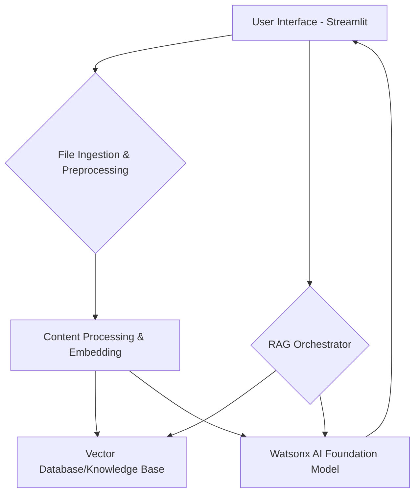

# RAG Chatbot with Multi-File Support

## 1. Overview

A comprehensive Retrieval-Augmented Generation (RAG) system built with Streamlit and Python that integrates with IBM Watsonx AI. This system allows users to upload various file types and chat with the content using natural language.

This document outlines the proposed architecture for a Retrieval-Augmented Generation (RAG) system that integrates with IBM Watsonx AI. The system will enable users to upload various file types, extract relevant information, and engage in a conversational chat with the content. The core idea is to leverage Watsonx AI's capabilities for natural language understanding, foundation models, and potentially specialized services like Watson Discovery for document processing.

## 2. High-Level Architecture

The RAG system will consist of the following main components:

1.  **User Interface (UI)**: A Streamlit-based web application for user interaction, including file upload (drag-and-drop) and a chat interface.
2.  **File Ingestion and Preprocessing Module**: Responsible for handling various file types, extracting raw content, and converting it into a standardized format suitable for further processing.
3.  **Content Processing and Embedding Module**: This module will process the extracted content, perform necessary transformations (e.g., OCR), chunk the data, and generate embeddings using Watsonx AI's embedding models.
4.  **Vector Database/Knowledge Base**: A storage solution for the generated embeddings and associated metadata, enabling efficient retrieval of relevant information.
5.  **Retrieval-Augmented Generation (RAG) Orchestrator**: This component will manage the flow of information, including retrieving relevant context from the knowledge base based on user queries and feeding it to the Watsonx AI foundation model for generating responses.
6.  **Watsonx AI Integration**: Leveraging various Watsonx AI services for core functionalities like foundation models (LLMs), embedding generation, and potentially specialized services for document understanding.



## 3. File Processing Pipeline

The system needs to handle a diverse set of file types. The file processing pipeline will be designed to accommodate these variations:

### 3.1. Supported File Types and Initial Handling

*   **Text Files (.txt, .md, .doc, .docx)**: Direct text extraction. For `.doc` and `.docx`, libraries like `python-docx` or `pandoc` will be considered.
*   **PDF Files (.pdf)**:
    *   **Text-based PDFs**: Direct text extraction using libraries like `PyPDF2` or `pdfminer.six`.
    *   **Scanned PDFs (Image-based PDFs)**: OCR (Optical Character Recognition) will be applied to extract text. IBM Watsonx AI's capabilities or external OCR libraries (e.g., `Tesseract` via `pytesseract`) will be evaluated.
*   **Spreadsheet Files (.xls, .xlsx)**: Data extraction from sheets into a structured format (e.g., Pandas DataFrames) using libraries like `pandas` and `openpyxl`.
*   **Image Files (.jpg, .png, etc.)**: OCR will be applied to extract any text present in the images. Image description or captioning models (potentially from Watsonx AI vision models) could be explored for richer context.


### 3.2. Common Processing Steps

After initial content extraction, all data will undergo common processing steps:

1.  **Cleaning and Normalization**: Removing irrelevant characters, formatting inconsistencies, and standardizing text.
2.  **Chunking**: Breaking down large documents or extracted text into smaller, manageable chunks. This is crucial for RAG systems to ensure that the retrieved context fits within the LLM's token limit and is relevant to the query.
3.  **Metadata Extraction**: Extracting relevant metadata (e.g., file name, creation date, author, section titles) to enrich the chunks and aid in retrieval.
4.  **Embedding Generation**: Converting text chunks into numerical vector embeddings using a Watsonx AI embedding model (e.g., `/ml/v1/text/embeddings` API endpoint).

## 4. Watsonx AI Integration Points

*   **Foundation Models (LLMs)**: For generating conversational responses based on retrieved context and user queries.
*   **Embedding Models**: For creating vector representations of text chunks and user queries.
*   **Watson Discovery (Potential)**: For advanced document understanding, smart document segmentation, and potentially managing the knowledge base for complex document types.
*   **Watsonx AI Vision Models (Potential)**: For image-to-text transcription (OCR) and potentially image understanding for richer context from images.

## 5. Data Flow for a User Query

1.  User uploads files via Streamlit UI.
2.  Files are processed through the ingestion and preprocessing pipeline.
3.  Processed chunks and their embeddings are stored in the Vector Database.
4.  User enters a query in the Streamlit chat interface.
5.  The query is embedded using the Watsonx AI embedding model.
6.  The RAG Orchestrator retrieves top-k most similar chunks from the Vector Database based on the query embedding.
7.  The retrieved chunks, along with the user's query, are sent to the Watsonx AI foundation model as context.
8.  The foundation model generates a response.
9.  The response is displayed in the Streamlit chat interface.

## 6. Considerations and Next Steps

*   **Error Handling**: Robust error handling will be implemented for all stages of the pipeline, especially during file processing and API calls.
*   **Scalability**: The architecture should consider future scalability, especially for handling large volumes of data and concurrent users.
*   **Security**: API keys and sensitive information will be handled securely (e.g., using Streamlit secrets).
*   **Performance**: Optimization of file processing and retrieval will be crucial for a responsive user experience.
*   **Specific Watsonx AI APIs**: Further investigation into the exact Watsonx AI APIs for each processing step (e.g., OCR for scanned images, specific embedding models) will be required during implementation.

This design provides a solid foundation for building the RAG system. The next phase will involve implementing the file processing modules based on this architecture.


## Features

### Supported File Types
- **Text Files**: `.txt`, `.md`
- **Documents**: `.pdf`, `.docx` (including scanned PDFs with OCR)
- **Spreadsheets**: `.xlsx`, `.xls`
- **Images**: `.png`, `.jpg`, `.jpeg` (with OCR text extraction)

### Key Capabilities
- **Drag-and-Drop File Upload**: Easy file upload interface
- **Multi-Modal Processing**: Handles text, images, audio, and documents
- **OCR Support**: Extracts text from scanned PDFs and images
- **Vector Database**: Uses ChromaDB for efficient document retrieval
- **RAG Integration**: Leverages Watsonx AI for intelligent responses
- **Chat Interface**: Interactive conversation with your documents

## Architecture

The system consists of several key components:

1. **File Processing Pipeline** (`file_processor.py`)
   - Handles multiple file formats
   - Performs OCR on images and scanned PDFs
   - Transcribes audio files
   - Chunks content for optimal retrieval

2. **Vector Database** (ChromaDB)
   - Stores document embeddings
   - Enables semantic search
   - Manages document metadata

3. **Streamlit Interface** (`rag_enhanced.py`)
   - User-friendly web interface
   - File upload and processing
   - Chat interface
   - Settings management

4. **Watsonx AI Integration**
   - Foundation models for text generation
   - Embedding generation (placeholder implementation)

## Installation

### Prerequisites
- Python 3.11+
- IBM Watsonx AI account and API credentials

### Required Packages
```bash
pip install streamlit
pip install ibm-watsonx-ai
pip install ibm-watson
pip install chromadb
pip install pypdf
pip install python-docx
pip install openpyxl
pip install pandas
pip install pytesseract
pip install Pillow
pip install pdf2image
pip install reportlab
```

### System Dependencies
```bash
# For OCR support
sudo apt-get install tesseract-ocr

# For PDF processing
sudo apt-get install poppler-utils
```

## Usage

### 1. Start the Application
```bash
streamlit run rag_enhanced.py --server.port 8505 --server.address 0.0.0.0
```

### 2. Configure Settings
In the sidebar, provide:
- **Watsonx AI API Key**: Your IBM Watsonx AI API key
- **Project ID**: Your Watsonx AI project ID
- **Endpoint URL**: Watsonx AI service endpoint
- **Model Selection**: Choose from available foundation models

### 3. Upload Files
- Use the drag-and-drop interface or browse to select files
- Supported formats: TXT, PDF, DOCX, XLSX, PNG, JPG, JPEG...
- Files are automatically processed and indexed

### 4. Chat with Documents
- Type questions in the chat interface
- The system retrieves relevant content and generates responses
- View processing statistics and source information

## File Processing Details

### Text Documents
- Direct text extraction from TXT, DOCX files
- PDF text extraction with fallback to OCR for scanned documents

### Images
- OCR using Tesseract to extract text content
- Supports common image formats (PNG, JPG, JPEG)

### Spreadsheets
- Extracts data from all sheets in Excel files
- Converts tabular data to text format

### Scanned Documents
- Automatically detects scanned PDFs (low text content)
- Converts PDF pages to images and applies OCR
- Extracts text from image-based documents

## Configuration

### Environment Variables
You can set the following environment variables or use Streamlit secrets:
- `WATSONX_API_KEY`: Your Watsonx AI API key
- `WATSONX_PROJECT_ID`: Your project ID
- `WATSONX_URL`: Service endpoint URL

### Streamlit Secrets
Create `.streamlit/secrets.toml`:
```toml
project_id = "your-project-id"
url = "your-watsonx-endpoint"
```

## API Integration

### Watsonx AI Foundation Models
The system supports various foundation models:
- **IBM Granite**: Text and code models
- **Meta LLaMA**: Various sizes and capabilities
- **Google**: Flan-T5 models
- **Mistral**: Large language models

## Performance Optimization

### Chunking Strategy
- Documents are split into manageable chunks (500 words with 50-word overlap)
- Preserves context while fitting within model token limits
- Metadata preserved for each chunk

### Vector Database
- ChromaDB provides efficient similarity search
- In-memory storage for development
- Can be configured for persistent storage

### Caching
- Streamlit caching for database initialization
- Processed files stored in session state
- Avoids reprocessing uploaded files

## Troubleshooting

### Common Issues

1. **Import Errors**
   - Ensure all required packages are installed
   - Check Python version compatibility

2. **OCR Not Working**
   - Install Tesseract: `sudo apt-get install tesseract-ocr`
   - Verify Tesseract is in PATH

3. **PDF Processing Errors**
   - Install poppler-utils: `sudo apt-get install poppler-utils`
   - Check PDF file permissions

5. **Watsonx AI Connection Issues**
   - Verify API credentials
   - Check endpoint URL format
   - Ensure project ID is correct

### Error Handling
The system includes comprehensive error handling:
- File processing errors are displayed to users
- API connection issues are caught and reported
- Graceful degradation for optional features

## Development

### File Structure
```
├── rag_enhanced.py          # Main Streamlit application
├── file_processor.py        # File processing utilities
├── system_architecture.md   # Architecture documentation
├── README.md               # This file
└── todo.md                 # Development progress
```

### Testing
Test the system with various file types:
1. Upload sample documents
2. Verify processing status
3. Test chat functionality
4. Check retrieval accuracy

### Extending the System
- Add support for new file formats in `file_processor.py`
- Implement custom embedding models
- Add more sophisticated retrieval algorithms
- Integrate additional Watsonx AI services

## Security Considerations

- API keys are handled securely through Streamlit secrets
- Temporary files are cleaned up after processing
- No persistent storage of sensitive data
- Input validation for uploaded files

## Limitations

- Embedding generation uses placeholder implementation
- Large files may impact performance
- Vector database is in-memory (not persistent)

## Future Enhancements

- Implement proper Watsonx AI embedding API integration
- Add support for more file formats
- Persistent vector database storage
- Advanced retrieval algorithms
- Multi-language support
- Batch file processing
- Export chat history

## License

This project is provided by Ai Crafters

## Support

For issues and questions:
1. Check the troubleshooting section
2. Verify all dependencies are installed
3. Ensure API credentials are correct
4. Review error messages for specific guidance

